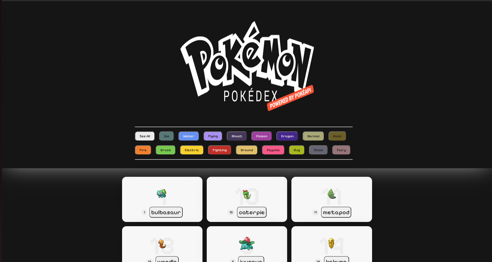
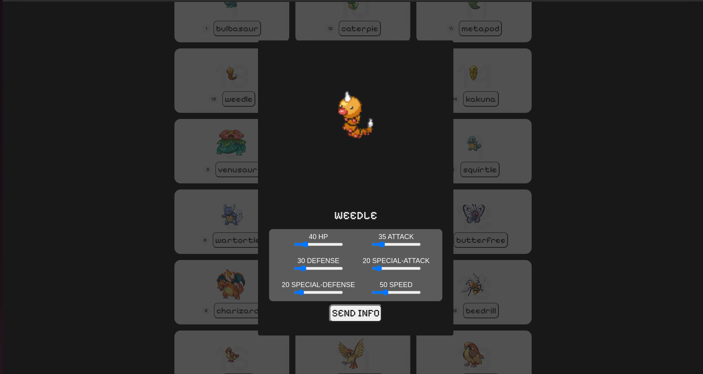

# Pokedex-Criolla




# Pokemon POST/PUT

This is the Pokemon API.
Here I use a special method which can send a pokemon to an API that saves it, if this pokemon exists it modifies it.

## API Reference

#### POST pokemones

**Method**: `POST`
**URL** : `/https://6509d04cf6553137159c10aa.mockapi.io/pokemones`

**Storage** : `pokemonMet.js`

**Module** : `enviarPokemon` 

**Querys** : `(url, data)`

**Auth Required** : `False`

```javascript
data = {
    name: "nombre",
    stats: {
        hp:12,
        attack:12,
        ...
    }
}
  
```

#### Modify pokemons 

**Method**: `PUT`
**URL** : `/https://6509d04cf6553137159c10aa.mockapi.io/pokemones`

**Storage** : `pokemonMet.js`

**Module** : `enviarPokemon` 

**Querys** : `(url, data)`

**Auth Required** : `False`

```javascript
data = {
    name: "nombre",
    stats: {
        hp:12,
        attack:12,
        ...
    }
}
```


## How To Use

To use the page we must click on the pokemons and see their information


Range inputs can be modified and will be sent to the mockapi


To add pokemon statistics to the mockapi what we must do is click on the "Apply" button

;


## Author

- [@johanp0308](https://github.com/johanp0308)
